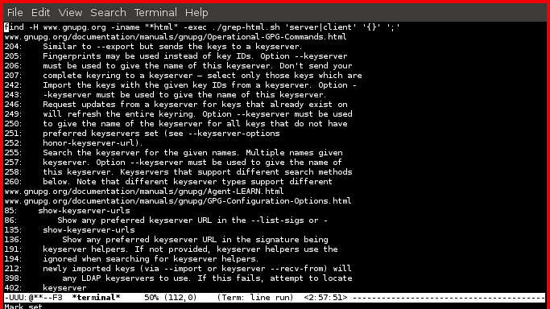

# grep-html

A utility to search through online documentation that's stored locally.  With
this we have the power to search through documentation that might not have
search functionality implemented on its site.  We can also use regexs for
searching the rendered html files.

# examples

The precursor to using this tool is usually a wget one liner such as:

    $ wget -E -K -k -m -np -w$secs --random-wait https://foo.com/docs/

After the docs have been mirrored locally, we invoke it using find's exec
switch:

    $ find foo.com/ -iname $html_target -exec ./grep-html.sh $query '{}' ';'

Below is an example session.  The utility will print out each file found by find
and if grep-html finds a line that matches your query it will print out the
result following the filename.  In this case, we look for an find information on
clients and servers in the gnupg documentation.

# installation requirements

-   grep (GNU grep) 2.10

-   find (GNU findutils) 4.4.2

-   GNU Emacs 24.4.50.1

# status

Does one thing and does it well.
